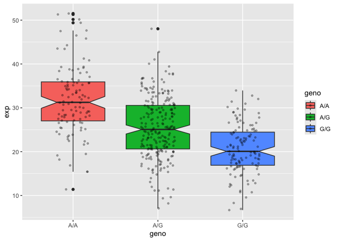

# Class 12: Worksheet Session
Yoonjin Lim (PID: A16850635)

- [Section 1. Proportion of G/G in a
  population](#section-1-proportion-of-gg-in-a-population)
- [Section 4: Population Scale
  Analysis](#section-4-population-scale-analysis)

## Section 1. Proportion of G/G in a population

Downloaded a CSV file from Ensemble \<
https://useast.ensembl.org/Homo_sapiens/Variation/Sample?db=core;r=17:39895045-39895145;v=rs8067378;vdb=variation;vf=959672880#373531_tablePanel
\>

Here we read this CSV file

``` r
mxl <- read.csv("373531-SampleGenotypes-Homo_sapiens_Variation_Sample_rs8067378(1).csv")
head(mxl)
```

      Sample..Male.Female.Unknown. Genotype..forward.strand. Population.s. Father
    1                  NA19648 (F)                       A|A ALL, AMR, MXL      -
    2                  NA19649 (M)                       G|G ALL, AMR, MXL      -
    3                  NA19651 (F)                       A|A ALL, AMR, MXL      -
    4                  NA19652 (M)                       G|G ALL, AMR, MXL      -
    5                  NA19654 (F)                       G|G ALL, AMR, MXL      -
    6                  NA19655 (M)                       A|G ALL, AMR, MXL      -
      Mother
    1      -
    2      -
    3      -
    4      -
    5      -
    6      -

``` r
table(mxl$Genotype..forward.strand.)
```


    A|A A|G G|A G|G 
     22  21  12   9 

``` r
table(mxl$Genotype..forward.strand.) / nrow(mxl) *100
```


        A|A     A|G     G|A     G|G 
    34.3750 32.8125 18.7500 14.0625 

Now, let’s look at a different population. I picked the GBR.

``` r
gbr <- read.csv("373522-SampleGenotypes-Homo_sapiens_Variation_Sample_rs8067378_GBR.csv")
```

Find a proportion of G\|G.

``` r
table(gbr$Genotype..forward.strand.)
```


    A|A A|G G|A G|G 
     23  17  24  27 

``` r
round(table(gbr$Genotype..forward.strand.) / nrow(gbr) * 100, 2)
```


      A|A   A|G   G|A   G|G 
    25.27 18.68 26.37 29.67 

Note: This varient that is associated with childhood asthma is more
frequent in the GBR population than the MXL population.

Let’s now dig into this further.

## Section 4: Population Scale Analysis

One sample is obviously not enough to know what is happening in a
population. You are interested in assessing genetic differences on a
population scale.

So, you processed about ~230 samples and did the normalization on a
genome level. Now, you want to find whether there is any association of
the 4 asthma-associated SNPs (rs8067378…) on ORMDL3 expression.

How many samples do we have?

> Q13: Read this file into R and determine the sample size for each
> genotype and their corresponding median expression levels for each of
> these genotypes.

``` r
expr <- read.table("rs8067378_ENSG00000172057.6.txt")
head(expr)
```

       sample geno      exp
    1 HG00367  A/G 28.96038
    2 NA20768  A/G 20.24449
    3 HG00361  A/A 31.32628
    4 HG00135  A/A 34.11169
    5 NA18870  G/G 18.25141
    6 NA11993  A/A 32.89721

``` r
nrow(expr) 
```

    [1] 462

``` r
table(expr$geno)
```


    A/A A/G G/G 
    108 233 121 

``` r
library(ggplot2)
```

Let’s make a boxplot.

``` r
ggplot(expr) + 
  aes(x=geno, y=exp, fill=geno) + 
  geom_boxplot(notch=TRUE) + 
  geom_jitter(size=1, col="black", alpha=0.3, width=0.2)
```



> Q14: Generate a boxplot with a box per genotype, what could you infer
> from the relative expression value between A/A and G/G displayed in
> this plot? Does the SNP effect the expression of ORMDL3?

Basically, we specifically found the SNPs that is likely to be
associated with childhood asthma from other people’s work using
genome-wide association studies. While tracking these SNPs down to the
specific location the chromosome 17, we found the genes that are
particularly related to and had done RNA-seq analysis of a particular
individual to see what their expression levels for this gene ORMDL3 are.
Based on the result, it seems that ORMDL3 gene is clearly getting
affected when having different SNPs. Now, in population scale, based on
the analysis of boxplot and result, I could see that allele G/G genotype
boxplot is already different than the other boxplot of A/G and
especially genotype A/A. This result clearly illustrates that having
allele G/G in this location of chromosome is definitely associated with
reduced expression of this particular gene ORMDL3, inferring for high
likelihood for childhood asthma eventually.
