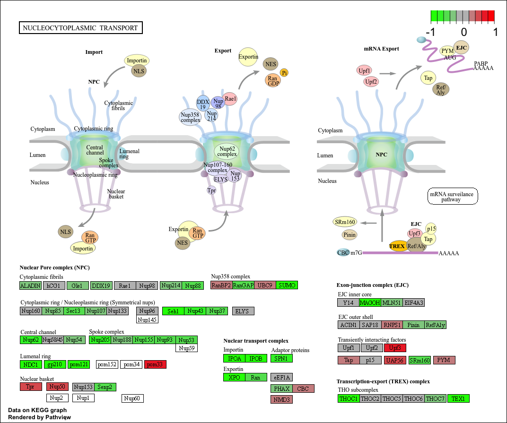
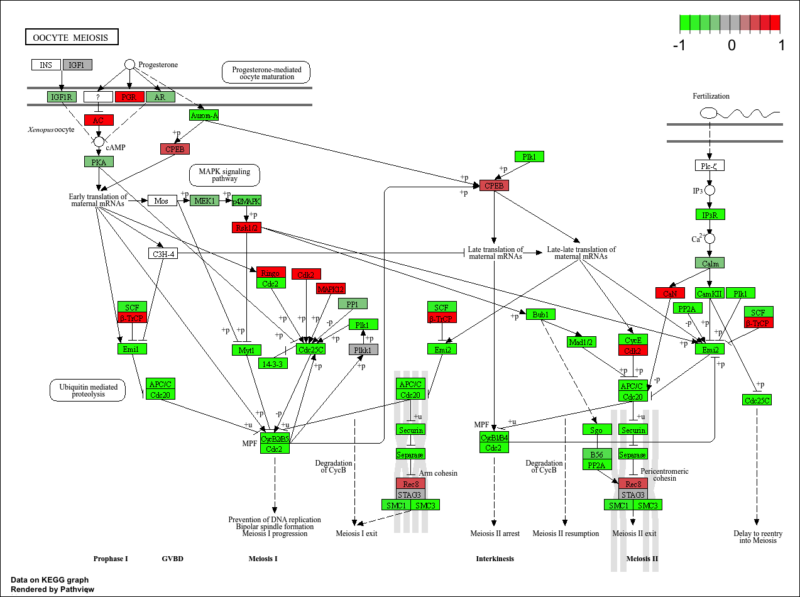

# Class 14: RNASeq mini-project
Yoonjin Lim (PID: A16850635)

- [Differential Expression Analysis](#differential-expression-analysis)
  - [Required packages](#required-packages)
  - [Data import](#data-import)
  - [Remove zero count genes](#remove-zero-count-genes)
  - [Setup DeSeq object for analysis](#setup-deseq-object-for-analysis)
- [Run DESeq analysis](#run-deseq-analysis)
  - [Extract the results](#extract-the-results)
  - [Add Gene annotation](#add-gene-annotation)
  - [Save my results to a CSV file](#save-my-results-to-a-csv-file)
  - [Result visualization](#result-visualization)
- [Pathway analysis](#pathway-analysis)
  - [KEGG genesets/paathways](#kegg-genesetspaathways)
- [Gene Ontology (GO) genesets](#gene-ontology-go-genesets)
- [Reactome analysis online](#reactome-analysis-online)

Here we will perform a complete RNASeq analysis from counts to pathways
and biological interpretation.

The data for for hands-on session comes from GEO entry: GSE37704, which
is associated with the following publication:

- Trapnell C, Hendrickson DG, Sauvageau M, Goff L et al. “Differential
  analysis of gene regulation at transcript resolution with RNA-seq”.
  Nat Biotechnol 2013 Jan;31(1):46-53. PMID: 23222703

The authors report on differential analysis of lung fibroblasts in
response to loss of the developmental transcription factor HOXA1.

# Differential Expression Analysis

## Required packages

``` r
library(DESeq2)
library(AnnotationDbi)
library(org.Hs.eg.db)
library(pathview)
library(gage)
library(gageData)
```

## Data import

``` r
colData <- read.csv("GSE37704_metadata.csv", row.names=1)
countData <- read.csv("GSE37704_featurecounts.csv", row.name=1)
```

``` r
head(colData)
```

                  condition
    SRR493366 control_sirna
    SRR493367 control_sirna
    SRR493368 control_sirna
    SRR493369      hoxa1_kd
    SRR493370      hoxa1_kd
    SRR493371      hoxa1_kd

``` r
head(countData)
```

                    length SRR493366 SRR493367 SRR493368 SRR493369 SRR493370
    ENSG00000186092    918         0         0         0         0         0
    ENSG00000279928    718         0         0         0         0         0
    ENSG00000279457   1982        23        28        29        29        28
    ENSG00000278566    939         0         0         0         0         0
    ENSG00000273547    939         0         0         0         0         0
    ENSG00000187634   3214       124       123       205       207       212
                    SRR493371
    ENSG00000186092         0
    ENSG00000279928         0
    ENSG00000279457        46
    ENSG00000278566         0
    ENSG00000273547         0
    ENSG00000187634       258

Check the corespondance of colData row and countData columns.

``` r
rownames(colData)
```

    [1] "SRR493366" "SRR493367" "SRR493368" "SRR493369" "SRR493370" "SRR493371"

``` r
colnames(countData)
```

    [1] "length"    "SRR493366" "SRR493367" "SRR493368" "SRR493369" "SRR493370"
    [7] "SRR493371"

> Q. Remove the troublesome first column so we match the metadata.
> \[Labsheet Question: Complete the code below to remove the troublesome
> first column from countData\]

``` r
counts <- countData[,-1]
```

``` r
head(counts)
```

                    SRR493366 SRR493367 SRR493368 SRR493369 SRR493370 SRR493371
    ENSG00000186092         0         0         0         0         0         0
    ENSG00000279928         0         0         0         0         0         0
    ENSG00000279457        23        28        29        29        28        46
    ENSG00000278566         0         0         0         0         0         0
    ENSG00000273547         0         0         0         0         0         0
    ENSG00000187634       124       123       205       207       212       258

``` r
all (rownames(colData) == colnames(counts))
```

    [1] TRUE

To remove the first column …

``` r
all(c(T,T,T))
```

    [1] TRUE

## Remove zero count genes

We will have rows in `counts` for genes that we can not say anything
about because they have zero expression in the particular tissue we are
looking at.

``` r
head(counts)
```

                    SRR493366 SRR493367 SRR493368 SRR493369 SRR493370 SRR493371
    ENSG00000186092         0         0         0         0         0         0
    ENSG00000279928         0         0         0         0         0         0
    ENSG00000279457        23        28        29        29        28        46
    ENSG00000278566         0         0         0         0         0         0
    ENSG00000273547         0         0         0         0         0         0
    ENSG00000187634       124       123       205       207       212       258

If the `rowSums()` is zero then a give gene (i.e. row) has no count data
and we should exclude these genes from further consideration.

``` r
to.keep <- rowSums(counts) != 0
cleancounts <- counts[to.keep,]
```

> Q. How many genes do we have left?

``` r
nrow(cleancounts)
```

    [1] 15975

## Setup DeSeq object for analysis

``` r
dds <- DESeqDataSetFromMatrix(countData = cleancounts, 
                              colData = colData, 
                              design = ~condition)
```

    Warning in DESeqDataSet(se, design = design, ignoreRank): some variables in
    design formula are characters, converting to factors

# Run DESeq analysis

``` r
dds <- DESeq(dds)
```

    estimating size factors

    estimating dispersions

    gene-wise dispersion estimates

    mean-dispersion relationship

    final dispersion estimates

    fitting model and testing

``` r
dds
```

    class: DESeqDataSet 
    dim: 15975 6 
    metadata(1): version
    assays(4): counts mu H cooks
    rownames(15975): ENSG00000279457 ENSG00000187634 ... ENSG00000276345
      ENSG00000271254
    rowData names(22): baseMean baseVar ... deviance maxCooks
    colnames(6): SRR493366 SRR493367 ... SRR493370 SRR493371
    colData names(2): condition sizeFactor

## Extract the results

``` r
res <- results(dds)
head(res)
```

    log2 fold change (MLE): condition hoxa1 kd vs control sirna 
    Wald test p-value: condition hoxa1 kd vs control sirna 
    DataFrame with 6 rows and 6 columns
                     baseMean log2FoldChange     lfcSE       stat      pvalue
                    <numeric>      <numeric> <numeric>  <numeric>   <numeric>
    ENSG00000279457   29.9136      0.1792571 0.3248216   0.551863 5.81042e-01
    ENSG00000187634  183.2296      0.4264571 0.1402658   3.040350 2.36304e-03
    ENSG00000188976 1651.1881     -0.6927205 0.0548465 -12.630158 1.43990e-36
    ENSG00000187961  209.6379      0.7297556 0.1318599   5.534326 3.12428e-08
    ENSG00000187583   47.2551      0.0405765 0.2718928   0.149237 8.81366e-01
    ENSG00000187642   11.9798      0.5428105 0.5215598   1.040744 2.97994e-01
                           padj
                      <numeric>
    ENSG00000279457 6.86555e-01
    ENSG00000187634 5.15718e-03
    ENSG00000188976 1.76549e-35
    ENSG00000187961 1.13413e-07
    ENSG00000187583 9.19031e-01
    ENSG00000187642 4.03379e-01

> Q. Call the summary() function on your results to get a sense of how
> many genes are up or down-regulated at the default 0.1 p-value cutoff.

``` r
summary(res)
```


    out of 15975 with nonzero total read count
    adjusted p-value < 0.1
    LFC > 0 (up)       : 4349, 27%
    LFC < 0 (down)     : 4396, 28%
    outliers [1]       : 0, 0%
    low counts [2]     : 1237, 7.7%
    (mean count < 0)
    [1] see 'cooksCutoff' argument of ?results
    [2] see 'independentFiltering' argument of ?results

## Add Gene annotation

``` r
head(res)
```

    log2 fold change (MLE): condition hoxa1 kd vs control sirna 
    Wald test p-value: condition hoxa1 kd vs control sirna 
    DataFrame with 6 rows and 6 columns
                     baseMean log2FoldChange     lfcSE       stat      pvalue
                    <numeric>      <numeric> <numeric>  <numeric>   <numeric>
    ENSG00000279457   29.9136      0.1792571 0.3248216   0.551863 5.81042e-01
    ENSG00000187634  183.2296      0.4264571 0.1402658   3.040350 2.36304e-03
    ENSG00000188976 1651.1881     -0.6927205 0.0548465 -12.630158 1.43990e-36
    ENSG00000187961  209.6379      0.7297556 0.1318599   5.534326 3.12428e-08
    ENSG00000187583   47.2551      0.0405765 0.2718928   0.149237 8.81366e-01
    ENSG00000187642   11.9798      0.5428105 0.5215598   1.040744 2.97994e-01
                           padj
                      <numeric>
    ENSG00000279457 6.86555e-01
    ENSG00000187634 5.15718e-03
    ENSG00000188976 1.76549e-35
    ENSG00000187961 1.13413e-07
    ENSG00000187583 9.19031e-01
    ENSG00000187642 4.03379e-01

``` r
head(rownames(res))
```

    [1] "ENSG00000279457" "ENSG00000187634" "ENSG00000188976" "ENSG00000187961"
    [5] "ENSG00000187583" "ENSG00000187642"

``` r
library(AnnotationDbi)
library(org.Hs.eg.db)
```

``` r
columns(org.Hs.eg.db)
```

     [1] "ACCNUM"       "ALIAS"        "ENSEMBL"      "ENSEMBLPROT"  "ENSEMBLTRANS"
     [6] "ENTREZID"     "ENZYME"       "EVIDENCE"     "EVIDENCEALL"  "GENENAME"    
    [11] "GENETYPE"     "GO"           "GOALL"        "IPI"          "MAP"         
    [16] "OMIM"         "ONTOLOGY"     "ONTOLOGYALL"  "PATH"         "PFAM"        
    [21] "PMID"         "PROSITE"      "REFSEQ"       "SYMBOL"       "UCSCKG"      
    [26] "UNIPROT"     

``` r
library("AnnotationDbi")
library("org.Hs.eg.db")

columns(org.Hs.eg.db)
```

     [1] "ACCNUM"       "ALIAS"        "ENSEMBL"      "ENSEMBLPROT"  "ENSEMBLTRANS"
     [6] "ENTREZID"     "ENZYME"       "EVIDENCE"     "EVIDENCEALL"  "GENENAME"    
    [11] "GENETYPE"     "GO"           "GOALL"        "IPI"          "MAP"         
    [16] "OMIM"         "ONTOLOGY"     "ONTOLOGYALL"  "PATH"         "PFAM"        
    [21] "PMID"         "PROSITE"      "REFSEQ"       "SYMBOL"       "UCSCKG"      
    [26] "UNIPROT"     

``` r
res$symbol <- mapIds(org.Hs.eg.db,
                    keys=rownames(res), 
                    keytype="ENSEMBL",
                    column="SYMBOL",
                    multiVals="first")
```

    'select()' returned 1:many mapping between keys and columns

``` r
res$entrez <- mapIds(org.Hs.eg.db,
                    keys=rownames(res),
                    keytype="ENSEMBL",
                    column="ENTREZID",
                    multiVals="first")
```

    'select()' returned 1:many mapping between keys and columns

``` r
res$name <- mapIds(org.Hs.eg.db,
                    keys=row.names(res),
                    keytype="ENSEMBL",
                    column="GENENAME",
                    multiVals="first")
```

    'select()' returned 1:many mapping between keys and columns

``` r
head(res, 10)
```

    log2 fold change (MLE): condition hoxa1 kd vs control sirna 
    Wald test p-value: condition hoxa1 kd vs control sirna 
    DataFrame with 10 rows and 9 columns
                       baseMean log2FoldChange     lfcSE       stat      pvalue
                      <numeric>      <numeric> <numeric>  <numeric>   <numeric>
    ENSG00000279457   29.913579      0.1792571 0.3248216   0.551863 5.81042e-01
    ENSG00000187634  183.229650      0.4264571 0.1402658   3.040350 2.36304e-03
    ENSG00000188976 1651.188076     -0.6927205 0.0548465 -12.630158 1.43990e-36
    ENSG00000187961  209.637938      0.7297556 0.1318599   5.534326 3.12428e-08
    ENSG00000187583   47.255123      0.0405765 0.2718928   0.149237 8.81366e-01
    ENSG00000187642   11.979750      0.5428105 0.5215598   1.040744 2.97994e-01
    ENSG00000188290  108.922128      2.0570638 0.1969053  10.446970 1.51282e-25
    ENSG00000187608  350.716868      0.2573837 0.1027266   2.505522 1.22271e-02
    ENSG00000188157 9128.439422      0.3899088 0.0467163   8.346304 7.04321e-17
    ENSG00000237330    0.158192      0.7859552 4.0804729   0.192614 8.47261e-01
                           padj      symbol      entrez                   name
                      <numeric> <character> <character>            <character>
    ENSG00000279457 6.86555e-01          NA          NA                     NA
    ENSG00000187634 5.15718e-03      SAMD11      148398 sterile alpha motif ..
    ENSG00000188976 1.76549e-35       NOC2L       26155 NOC2 like nucleolar ..
    ENSG00000187961 1.13413e-07      KLHL17      339451 kelch like family me..
    ENSG00000187583 9.19031e-01     PLEKHN1       84069 pleckstrin homology ..
    ENSG00000187642 4.03379e-01       PERM1       84808 PPARGC1 and ESRR ind..
    ENSG00000188290 1.30538e-24        HES4       57801 hes family bHLH tran..
    ENSG00000187608 2.37452e-02       ISG15        9636 ISG15 ubiquitin like..
    ENSG00000188157 4.21963e-16        AGRN      375790                  agrin
    ENSG00000237330          NA      RNF223      401934 ring finger protein ..

## Save my results to a CSV file

``` r
res = res[order(res$pvalue),]
write.csv(res, file="deseq_results.csv")
```

## Result visualization

``` r
mycols <- rep("gray", nrow(res))
mycols[res$log2FoldChange <= -2] <- "blue"
mycols[res$log2FoldChange >= +2] <- "blue"
mycols[res$padj >= 0.05] <- "gray"

#mycols
plot(res$log2FoldChange, -log(res$padj), col=mycols, xlab="Log2(FoldChange)", ylab="-Log(P-value)")
abline(v=-2, col="red")
abline(v=+2, col="red")
abline(h=-log(0.05), col="red")
```


``` r
library(ggplot2)
library(ggrepel)

ggplot(res) + 
  aes(log2FoldChange, -log(padj), label=res$symbol) + 
  geom_point(col=mycols) + 
  geom_text_repel(size=4, max.overlaps = 8)
```

    Warning: Removed 1237 rows containing missing values or values outside the scale range
    (`geom_point()`).

    Warning: Removed 1409 rows containing missing values or values outside the scale range
    (`geom_text_repel()`).

    Warning: ggrepel: 14538 unlabeled data points (too many overlaps). Consider
    increasing max.overlaps


``` r
ggplot(as.data.frame(res)) +
  aes(res$log2FoldChange, -log(padj)) +
  geom_point(col=mycols) +
  geom_vline(xintercept = c(-2,+2), col= "red") +
  geom_hline(yintercept = -log(0.05), col="red") +
  theme_bw() +
  labs(title = "Plot of Log2 Fold-Change vs. -log(Adjusted P-value)",
       x= "Log2 Fold-Change",
       y = "-log(Adjusted P-value)")
```

    Warning: Removed 1237 rows containing missing values or values outside the scale range
    (`geom_point()`).


# Pathway analysis

## KEGG genesets/paathways

``` r
data(kegg.sets.hs)
data(sigmet.idx.hs)

# Focus on signaling and metabolic pathways only
kegg.sets.hs = kegg.sets.hs[sigmet.idx.hs]

# Examine the first 3 pathways
head(kegg.sets.hs, 3)
```

    $`hsa00232 Caffeine metabolism`
    [1] "10"   "1544" "1548" "1549" "1553" "7498" "9"   

    $`hsa00983 Drug metabolism - other enzymes`
     [1] "10"     "1066"   "10720"  "10941"  "151531" "1548"   "1549"   "1551"  
     [9] "1553"   "1576"   "1577"   "1806"   "1807"   "1890"   "221223" "2990"  
    [17] "3251"   "3614"   "3615"   "3704"   "51733"  "54490"  "54575"  "54576" 
    [25] "54577"  "54578"  "54579"  "54600"  "54657"  "54658"  "54659"  "54963" 
    [33] "574537" "64816"  "7083"   "7084"   "7172"   "7363"   "7364"   "7365"  
    [41] "7366"   "7367"   "7371"   "7372"   "7378"   "7498"   "79799"  "83549" 
    [49] "8824"   "8833"   "9"      "978"   

    $`hsa00230 Purine metabolism`
      [1] "100"    "10201"  "10606"  "10621"  "10622"  "10623"  "107"    "10714" 
      [9] "108"    "10846"  "109"    "111"    "11128"  "11164"  "112"    "113"   
     [17] "114"    "115"    "122481" "122622" "124583" "132"    "158"    "159"   
     [25] "1633"   "171568" "1716"   "196883" "203"    "204"    "205"    "221823"
     [33] "2272"   "22978"  "23649"  "246721" "25885"  "2618"   "26289"  "270"   
     [41] "271"    "27115"  "272"    "2766"   "2977"   "2982"   "2983"   "2984"  
     [49] "2986"   "2987"   "29922"  "3000"   "30833"  "30834"  "318"    "3251"  
     [57] "353"    "3614"   "3615"   "3704"   "377841" "471"    "4830"   "4831"  
     [65] "4832"   "4833"   "4860"   "4881"   "4882"   "4907"   "50484"  "50940" 
     [73] "51082"  "51251"  "51292"  "5136"   "5137"   "5138"   "5139"   "5140"  
     [81] "5141"   "5142"   "5143"   "5144"   "5145"   "5146"   "5147"   "5148"  
     [89] "5149"   "5150"   "5151"   "5152"   "5153"   "5158"   "5167"   "5169"  
     [97] "51728"  "5198"   "5236"   "5313"   "5315"   "53343"  "54107"  "5422"  
    [105] "5424"   "5425"   "5426"   "5427"   "5430"   "5431"   "5432"   "5433"  
    [113] "5434"   "5435"   "5436"   "5437"   "5438"   "5439"   "5440"   "5441"  
    [121] "5471"   "548644" "55276"  "5557"   "5558"   "55703"  "55811"  "55821" 
    [129] "5631"   "5634"   "56655"  "56953"  "56985"  "57804"  "58497"  "6240"  
    [137] "6241"   "64425"  "646625" "654364" "661"    "7498"   "8382"   "84172" 
    [145] "84265"  "84284"  "84618"  "8622"   "8654"   "87178"  "8833"   "9060"  
    [153] "9061"   "93034"  "953"    "9533"   "954"    "955"    "956"    "957"   
    [161] "9583"   "9615"  

``` r
foldchanges = res$log2FoldChange
names(foldchanges) = res$entrez
head(foldchanges)
```

         1266     54855      1465     51232      2034      2317 
    -2.422719  3.201955 -2.313738 -2.059631 -1.888019 -1.649792 

``` r
keggres = gage(foldchanges, gsets=kegg.sets.hs)
```

``` r
attributes(keggres)
```

    $names
    [1] "greater" "less"    "stats"  

``` r
head(keggres$less, 4)
```

                                         p.geomean stat.mean        p.val
    hsa04110 Cell cycle               8.995727e-06 -4.378644 8.995727e-06
    hsa03030 DNA replication          9.424076e-05 -3.951803 9.424076e-05
    hsa03013 RNA transport            1.375901e-03 -3.028500 1.375901e-03
    hsa03440 Homologous recombination 3.066756e-03 -2.852899 3.066756e-03
                                            q.val set.size         exp1
    hsa04110 Cell cycle               0.001448312      121 8.995727e-06
    hsa03030 DNA replication          0.007586381       36 9.424076e-05
    hsa03013 RNA transport            0.073840037      144 1.375901e-03
    hsa03440 Homologous recombination 0.121861535       28 3.066756e-03

``` r
pathview(gene.data=foldchanges, pathway.id="hsa04110")
```

    'select()' returned 1:1 mapping between keys and columns

    Info: Working in directory /Users/yoonjinlim/Desktop/BIMM 143/bimm143_github/Class014

    Info: Writing image file hsa04110.pathview.png


``` r
## Focus on top 5 upregulated pathways here for demo purposes only
keggrespathways <- rownames(keggres$greater)[1:5]
```

``` r
# Extract the 8 character long IDs part of each string
keggresids = substr(keggrespathways, start=1, stop=8)
keggresids
```

    [1] "hsa04640" "hsa04630" "hsa00140" "hsa04142" "hsa04330"

> Q. Can you do the same procedure as above to plot the pathview figures
> for the top 5 down-reguled pathways?

``` r
## Focus on top 5 downregulated pathways here for demo purposes only
keggresdownpathways <- rownames(keggres$less)[1:5]

# Extract the 8 character long IDs part of each string
keggresidsd = substr(keggresdownpathways, start=1, stop=8)
keggresidsd
```

    [1] "hsa04110" "hsa03030" "hsa03013" "hsa03440" "hsa04114"

``` r
pathview(gene.data=foldchanges, pathway.id=keggresidsd, species="hsa")
```







# Gene Ontology (GO) genesets

``` r
data(go.sets.hs)
data(go.subs.hs)

# Focus on Biological Process subset of GO
gobpsets = go.sets.hs[go.subs.hs$BP]

gobpres = gage(foldchanges, gsets=gobpsets)
```

``` r
head(gobpres$less, 5)
```

                                                p.geomean stat.mean        p.val
    GO:0048285 organelle fission             1.536227e-15 -8.063910 1.536227e-15
    GO:0000280 nuclear division              4.286961e-15 -7.939217 4.286961e-15
    GO:0007067 mitosis                       4.286961e-15 -7.939217 4.286961e-15
    GO:0000087 M phase of mitotic cell cycle 1.169934e-14 -7.797496 1.169934e-14
    GO:0007059 chromosome segregation        2.028624e-11 -6.878340 2.028624e-11
                                                    q.val set.size         exp1
    GO:0048285 organelle fission             5.841698e-12      376 1.536227e-15
    GO:0000280 nuclear division              5.841698e-12      352 4.286961e-15
    GO:0007067 mitosis                       5.841698e-12      352 4.286961e-15
    GO:0000087 M phase of mitotic cell cycle 1.195672e-11      362 1.169934e-14
    GO:0007059 chromosome segregation        1.658603e-08      142 2.028624e-11

# Reactome analysis online

We need to make a little file of our significant genes that we can
upload to the reactome webpage:

``` r
sig_genes <- res[res$padj <= 0.05 & !is.na(res$padj), "symbol"]
print(paste("Total number of significant genes:", length(sig_genes)))
```

    [1] "Total number of significant genes: 8147"

``` r
sig_genes[6]
```

    ENSG00000136068 
             "FLNB" 

``` r
write.table(sig_genes, file="significant_genes.txt", row.names=FALSE, col.names=FALSE, quote=FALSE)
```

Then, to perform pathway analysis online go to the Reactome website
(https://reactome.org/PathwayBrowser/#TOOL=AT). Select “choose file” to
upload your significant gene list. Then, select the parameters “Project
to Humans”, then click “Analyze”.


> Q. What pathway has the most significant “Entities p-value”? Do the
> most significant pathways listed match your previous KEGG results?
> What factors could cause differences between the two methods?

Based on Reactome analysis, “cell cycle” has the most significant
Entities p-value as it is the lowest 9.3E-5. The Reactome analysis lists
several different pathways ranked by Entities p-value, reflecting how
statistically significant enriched a pathway is with the the
differentially expressed genes (DEGs) from RNASeq analysis. This result
illustrates how many of the differentially expressed genes fall within
the cell cycle pathway, to infer HOXA1 knockdown influences genes
regulating the cell cycle.

With this result, I believe that the most significant pathways listed
match my previous KEGG results. Based on KEGG analysis, the top
less/down pathways was found as cell cycle with KEGG pathway identifier,
“hsa04110”, meaning that the top enriched pathways is cell cycle among
the pathways with mostly down-regulated genes, the genes whose
expression decreased after HOXA1 knockdown. The Reactome and KEGG
pathway analysis both identify the cell cycle pathway as significantly
enriched with down-regulated genes in particular, ensuring the HOXA1
knockdown disrupts cell cycle gene regulation.

Lastly, the KEGG pathway database is more likely to provide functional
annotation as well as information about gene products that interact with
each other in a given pathway, how they interact, and where they
interact. Therefore, KEGG has the potential to provide extra metabolic
insight beyond annotation lists of simple molecular function, process.
On the other hand, the Reactome is database consisting of biological
molecules and their relation to pathways and processes to more focus on
biochemical analysis. Moreover, I felt that the KEGG tends to group more
broader processes, whereas the Reactome more focus on the finer-grained
sub-pathways.
