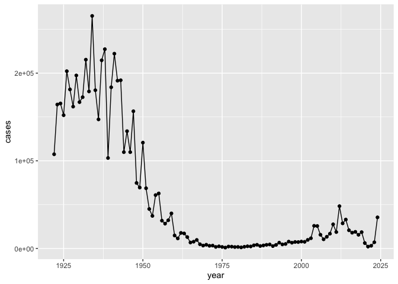
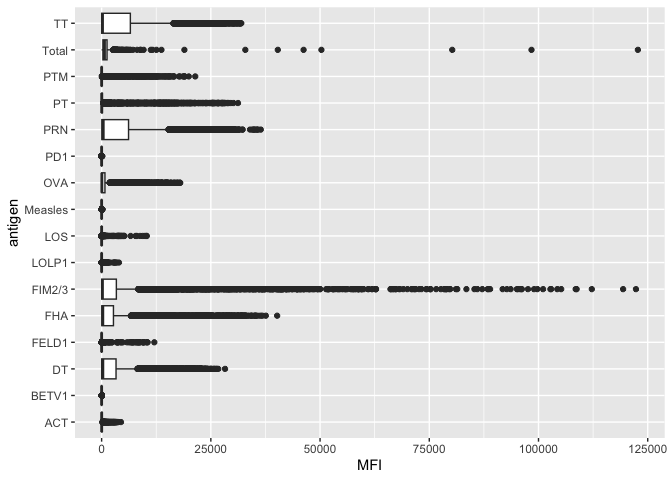
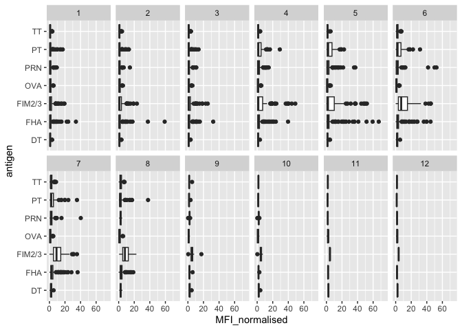
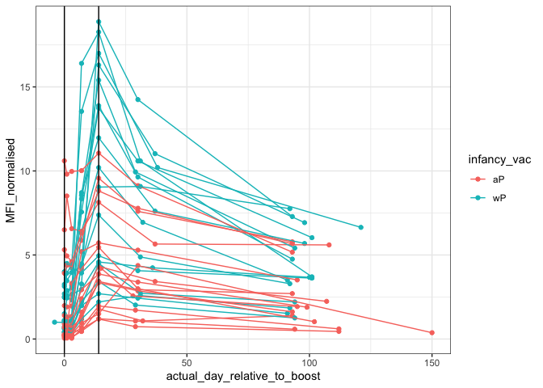

# Class 18: Pertussis Mini Project
Yoonjin Lim (PID: A16850635)

- [Background](#background)
- [Examining cases of Pertussis by
  year](#examining-cases-of-pertussis-by-year)
- [Enter the CMI-PB project](#enter-the-cmi-pb-project)
- [Focus on IgG levels](#focus-on-igg-levels)

## Background

Pertussis (a.k.a. whooping cough) is a common lung infection caused by
the bacteria *B. Pertussis*.

The CDC tracks cases of Pertussis in the U.S:
https://www.cdc.gov/pertussis/php/surveillance/pertussis-cases-by-year.html

## Examining cases of Pertussis by year

We can use the **datapasta** package to scrape case numbers from the CDC
website.

> Q1. Make a plot of pertussis cases per year using ggplot

``` r
library(ggplot2)

cases <- ggplot(cdc) + 
  aes (year, cases) + 
  geom_point() + 
  geom_line()

cases
```



> Q2. Add some key time points in our history of interaction with
> Pertussis to our plot. These include wP roll-out (the first vaccine)
> in 1946 and the switch to aP in 1996.

We can use `geom_vline()` for this. We can also use this function to add
the key time point for COVID-19 in 2020.

``` r
cases + 
  geom_vline(xintercept=1946, col="blue") + 
  geom_vline(xintercept=1996, col="red") + 
  geom_vline(xintercept=2020, col="purple")
```


Yoonjin’s Notes: Covid in 2020 =\> the first peak and after 2020..
another peak .. based on the observation. why cases number increases? -
bacteria.. this bacteria doesn’t seem to replicate crazy like virus.. -
vaccine hesitancy - socioeconomic factor

However, what we observed was instead … - Japan switched over their
vaccine.. UK .. highly suggested something up related to this vaccine..

highly suggested that this new vaccine aP something about immune
protection provided affected protection goes away faster … based on the
faster increased number of the cases. However, this should not be
happened.

> Q3. Describe what happened after the introduction of the aP vaccine?
> Do you have a possible explanation for the observed trend?

Based on the graph above, it is clearly seen that the Pertussis cases
have increased after the introduction of the aP vaccine from 1996. For
example, it is observed that there is a high peak of Pertussis cases
reported around 2012. Even though the cases has decreased after this
peak, it is clear that this is a different trend observed when compared
to the effect of wP vaccine. About this result, several different
hypothesis has been suggested for the resurgence of Pertussis case:
vaccination hesitancy, bacterial evolution escaped from vaccine
immunity, socioeconomic factors, and weakened immunity in puberty who
got the vaccine as infants with the aP vaccine. However, it was instead
highly suggested that something about immune protection provided from
the newer aP vaccine impacts the immunity to go away faster based on the
faster increase in the number of Pertussis cases, which is not supposed
to happen.

Mounting evidence suggests that the newer **aP** vaccine is less
effective over the long term than than the older **wP** vaccine that it
replaced. In other words, vaccine protection wanes more rapidly with ap
than with wP…because the case number increase pretty rapidly after 1996.

=\> Immune responses for each vaccine is different

## Enter the CMI-PB project

CMI-PB (computational Models of Immunity - Pertussis Boost) major goal
is to investigate how the immune responds differently to with aP vs. wP
vaccinated individuals and be able to predict this at an early stage.

CMI-PB makes all their collected data freely available and they store it
in a database composed different tables. Here we will access a few of
these.

We can use the **jsonlite** package to read this data.

``` r
library(jsonlite)

subject <- read_json("https://www.cmi-pb.org/api/v5_1/subject", 
                     simplifyVector = TRUE)

head(subject)
```

      subject_id infancy_vac biological_sex              ethnicity  race
    1          1          wP         Female Not Hispanic or Latino White
    2          2          wP         Female Not Hispanic or Latino White
    3          3          wP         Female                Unknown White
    4          4          wP           Male Not Hispanic or Latino Asian
    5          5          wP           Male Not Hispanic or Latino Asian
    6          6          wP         Female Not Hispanic or Latino White
      year_of_birth date_of_boost      dataset
    1    1986-01-01    2016-09-12 2020_dataset
    2    1968-01-01    2019-01-28 2020_dataset
    3    1983-01-01    2016-10-10 2020_dataset
    4    1988-01-01    2016-08-29 2020_dataset
    5    1991-01-01    2016-08-29 2020_dataset
    6    1988-01-01    2016-10-10 2020_dataset

> Q. How many subjects (i.e. enrolled people) are there in this dataset?

``` r
nrow(subject)
```

    [1] 172

> Q4. How many “aP” and “wP” subjects are there?

``` r
subject$infancy_vac
```

      [1] "wP" "wP" "wP" "wP" "wP" "wP" "wP" "wP" "aP" "wP" "wP" "wP" "aP" "wP" "wP"
     [16] "wP" "wP" "aP" "wP" "wP" "wP" "wP" "wP" "wP" "wP" "wP" "aP" "wP" "aP" "wP"
     [31] "wP" "aP" "wP" "wP" "wP" "aP" "aP" "aP" "wP" "wP" "wP" "aP" "aP" "aP" "aP"
     [46] "aP" "aP" "aP" "aP" "aP" "aP" "aP" "aP" "aP" "aP" "aP" "aP" "aP" "aP" "aP"
     [61] "wP" "wP" "wP" "wP" "wP" "wP" "wP" "wP" "wP" "aP" "aP" "wP" "wP" "wP" "aP"
     [76] "aP" "wP" "wP" "wP" "wP" "wP" "aP" "aP" "aP" "aP" "aP" "aP" "aP" "aP" "aP"
     [91] "aP" "aP" "aP" "aP" "aP" "aP" "wP" "wP" "aP" "aP" "aP" "aP" "wP" "wP" "wP"
    [106] "aP" "aP" "wP" "wP" "aP" "wP" "aP" "aP" "wP" "aP" "aP" "aP" "aP" "aP" "wP"
    [121] "aP" "aP" "wP" "aP" "wP" "wP" "aP" "wP" "wP" "wP" "aP" "wP" "aP" "wP" "wP"
    [136] "wP" "aP" "aP" "wP" "aP" "wP" "aP" "aP" "aP" "aP" "wP" "aP" "wP" "wP" "wP"
    [151] "wP" "wP" "aP" "aP" "aP" "aP" "aP" "aP" "wP" "aP" "aP" "aP" "wP" "wP" "wP"
    [166] "aP" "aP" "wP" "aP" "wP" "wP" "wP"

``` r
table(subject$infancy_vac)
```


    aP wP 
    87 85 

> Q5. How many Male/Female are in the dataset?

``` r
table(subject$biological_sex)
```


    Female   Male 
       112     60 

> Q6. How about gender and race numbers?

``` r
table(subject$race, subject$biological_sex)
```

                                               
                                                Female Male
      American Indian/Alaska Native                  0    1
      Asian                                         32   12
      Black or African American                      2    3
      More Than One Race                            15    4
      Native Hawaiian or Other Pacific Islander      1    1
      Unknown or Not Reported                       14    7
      White                                         48   32

> Q. Is this representative of the US population?

NO. Definitely not. Because this is only a sub-population using few
enrolled people, which doesn’t represent all US population
quantitatively. We need definitely more data for representing the US
population.

Notes: they use the year-of birth because age changes every single year.

> Q7. Using this approach determine (i) the average age of wP
> individuals, (ii) the average age of aP individuals; and (iii) are
> they significantly different?

``` r
library(lubridate)
```


    Attaching package: 'lubridate'

    The following objects are masked from 'package:base':

        date, intersect, setdiff, union

``` r
today()
```

    [1] "2025-06-05"

``` r
today() - ymd("2000-01-01")
```

    Time difference of 9287 days

``` r
time_length( today() - ymd("2000-01-01"),  "years")
```

    [1] 25.42642

``` r
# Use todays date to calculate age in days
subject$age <- today() - ymd(subject$year_of_birth)
```

``` r
library(dplyr)
```


    Attaching package: 'dplyr'

    The following objects are masked from 'package:stats':

        filter, lag

    The following objects are masked from 'package:base':

        intersect, setdiff, setequal, union

``` r
ap <- subject %>% filter(infancy_vac == "aP")

round( summary( time_length( ap$age, "years" ) ) )
```

       Min. 1st Qu.  Median    Mean 3rd Qu.    Max. 
         22      26      27      27      28      34 

``` r
# wP
wp <- subject %>% filter(infancy_vac == "wP")
round( summary( time_length( wp$age, "years" ) ) )
```

       Min. 1st Qu.  Median    Mean 3rd Qu.    Max. 
         22      32      34      36      39      57 

> Q8. Determine the age of all individuals at time of boost?

``` r
int <- ymd(subject$date_of_boost) - ymd(subject$year_of_birth)
age_at_boost <- time_length(int, "year")
head(age_at_boost)
```

    [1] 30.69678 51.07461 33.77413 28.65982 25.65914 28.77481

Let’s read another database table from CMI-PB.

``` r
specimen <- read_json("https://www.cmi-pb.org/api/v5_1/specimen", 
                      simplifyVector = TRUE)
ab_data <- read_json ("https://www.cmi-pb.org/api/v5_1/plasma_ab_titer",
                     simplifyVector=TRUE)
```

Wee peak at these.

``` r
head(specimen)
```

      specimen_id subject_id actual_day_relative_to_boost
    1           1          1                           -3
    2           2          1                            1
    3           3          1                            3
    4           4          1                            7
    5           5          1                           11
    6           6          1                           32
      planned_day_relative_to_boost specimen_type visit
    1                             0         Blood     1
    2                             1         Blood     2
    3                             3         Blood     3
    4                             7         Blood     4
    5                            14         Blood     5
    6                            30         Blood     6

We want to “join” these tables to get all our information together. FOr
this we will use **dplyr** package and the `inner_join()` function.

> Q9_a. With the help of a faceted boxplot or histogram (see below), do
> you think these two groups are significantly different?

``` r
ggplot(subject) +
  aes(time_length(age, "year"),
      fill=as.factor(infancy_vac)) +
  geom_histogram(show.legend=FALSE) +
  facet_wrap(vars(infancy_vac), nrow=2) +
  xlab("Age in years")
```

    `stat_bin()` using `bins = 30`. Pick better value with `binwidth`.


With the help of facet boxplot/historgram, I believe that these two
groups wP and aP are significantly different in age. The aP group tends
to be younger, whereas the wP group is older because the histogram of
the aP group is more shifted to the left side, indicating younger people
while the wP group’s histogram is shifted toward the right side,
representing older people. Based on the boxplot/histogram, I could
clearly see the significant different in age distribution between these
groups. I believe that this result is highly predicted because the aP
vaccine replaced the wP vaccine in 1990s.

``` r
# Or use wilcox.test() 
x <- t.test(time_length( wp$age, "years" ),
       time_length( ap$age, "years" ))

x$p.value
```

    [1] 2.372101e-23

Even the p-value of 2.372101e-23 illustrates that the probability of the
age difference between the aP and the wP groups happened by just random
chance is extremely low. This data supports highly statistically
significant difference in age between the wP and aP groups. Since the
vaccination type is likely related to the age, this suggests that the
age and vaccination are not just independent.

> Q9_b. Complete the code to join specimen and subject tables to make a
> new merged data frame containing all specimen records along with their
> associated subject details:

``` r
library(dplyr)

meta <- inner_join(subject, specimen)
```

    Joining with `by = join_by(subject_id)`

``` r
head(meta)
```

      subject_id infancy_vac biological_sex              ethnicity  race
    1          1          wP         Female Not Hispanic or Latino White
    2          1          wP         Female Not Hispanic or Latino White
    3          1          wP         Female Not Hispanic or Latino White
    4          1          wP         Female Not Hispanic or Latino White
    5          1          wP         Female Not Hispanic or Latino White
    6          1          wP         Female Not Hispanic or Latino White
      year_of_birth date_of_boost      dataset        age specimen_id
    1    1986-01-01    2016-09-12 2020_dataset 14400 days           1
    2    1986-01-01    2016-09-12 2020_dataset 14400 days           2
    3    1986-01-01    2016-09-12 2020_dataset 14400 days           3
    4    1986-01-01    2016-09-12 2020_dataset 14400 days           4
    5    1986-01-01    2016-09-12 2020_dataset 14400 days           5
    6    1986-01-01    2016-09-12 2020_dataset 14400 days           6
      actual_day_relative_to_boost planned_day_relative_to_boost specimen_type
    1                           -3                             0         Blood
    2                            1                             1         Blood
    3                            3                             3         Blood
    4                            7                             7         Blood
    5                           11                            14         Blood
    6                           32                            30         Blood
      visit
    1     1
    2     2
    3     3
    4     4
    5     5
    6     6

``` r
dim(meta)
```

    [1] 1503   14

``` r
head(ab_data)
```

      specimen_id isotype is_antigen_specific antigen        MFI MFI_normalised
    1           1     IgE               FALSE   Total 1110.21154       2.493425
    2           1     IgE               FALSE   Total 2708.91616       2.493425
    3           1     IgG                TRUE      PT   68.56614       3.736992
    4           1     IgG                TRUE     PRN  332.12718       2.602350
    5           1     IgG                TRUE     FHA 1887.12263      34.050956
    6           1     IgE                TRUE     ACT    0.10000       1.000000
       unit lower_limit_of_detection
    1 UG/ML                 2.096133
    2 IU/ML                29.170000
    3 IU/ML                 0.530000
    4 IU/ML                 6.205949
    5 IU/ML                 4.679535
    6 IU/ML                 2.816431

One more “join” to get ab_data and meta all together.

> Q10. Now using the same procedure join meta with titer data so we can
> further analyze this data in terms of time of visit aP/wP, male/female
> etc.

``` r
abdata <- inner_join(ab_data, meta)
```

    Joining with `by = join_by(specimen_id)`

``` r
head(abdata)
```

      specimen_id isotype is_antigen_specific antigen        MFI MFI_normalised
    1           1     IgE               FALSE   Total 1110.21154       2.493425
    2           1     IgE               FALSE   Total 2708.91616       2.493425
    3           1     IgG                TRUE      PT   68.56614       3.736992
    4           1     IgG                TRUE     PRN  332.12718       2.602350
    5           1     IgG                TRUE     FHA 1887.12263      34.050956
    6           1     IgE                TRUE     ACT    0.10000       1.000000
       unit lower_limit_of_detection subject_id infancy_vac biological_sex
    1 UG/ML                 2.096133          1          wP         Female
    2 IU/ML                29.170000          1          wP         Female
    3 IU/ML                 0.530000          1          wP         Female
    4 IU/ML                 6.205949          1          wP         Female
    5 IU/ML                 4.679535          1          wP         Female
    6 IU/ML                 2.816431          1          wP         Female
                   ethnicity  race year_of_birth date_of_boost      dataset
    1 Not Hispanic or Latino White    1986-01-01    2016-09-12 2020_dataset
    2 Not Hispanic or Latino White    1986-01-01    2016-09-12 2020_dataset
    3 Not Hispanic or Latino White    1986-01-01    2016-09-12 2020_dataset
    4 Not Hispanic or Latino White    1986-01-01    2016-09-12 2020_dataset
    5 Not Hispanic or Latino White    1986-01-01    2016-09-12 2020_dataset
    6 Not Hispanic or Latino White    1986-01-01    2016-09-12 2020_dataset
             age actual_day_relative_to_boost planned_day_relative_to_boost
    1 14400 days                           -3                             0
    2 14400 days                           -3                             0
    3 14400 days                           -3                             0
    4 14400 days                           -3                             0
    5 14400 days                           -3                             0
    6 14400 days                           -3                             0
      specimen_type visit
    1         Blood     1
    2         Blood     1
    3         Blood     1
    4         Blood     1
    5         Blood     1
    6         Blood     1

``` r
dim(abdata)
```

    [1] 61956    21

> Q11. How many Ab isotypes/antibodies are there in the dataset?

``` r
table(abdata$isotype)
```


      IgE   IgG  IgG1  IgG2  IgG3  IgG4 
     6698  7265 11993 12000 12000 12000 

> Q12. What are the different \$dataset values in abdata and what do you
> notice about the number of rows for the most “recent” dataset?

``` r
table(abdata$dataset)
```


    2020_dataset 2021_dataset 2022_dataset 2023_dataset 
           31520         8085         7301        15050 

In abdata, the `abdata$dataset` column includes different data values
from four years: 2020_dataset, 2021_dataset, 2022_dataset, and
2023_dataset. This different data values indicate specimens collected
and analyzed in each of these years. Specifically, 31,520 specimens were
collected from 2020. Similarly, 8,085 specimens, 7,301 specimens, and
15,050 specimens were collected and analyzed from each 2021, 2022, and
2023. Interestingly, the 2020_dataset has the largest number of rows,
whereas the other year_dataset such as the most recent dataset
2023_dataset has fewer number of rows than the year 2020. However, the
2023_dataset has higher number of rows than 2021 and 2022. The number of
specimens dropped in 2021 and 2022 mainly because of the COVID-19
pandemic disrupting regular lab and clinic operations. I believe that
2020_dataset still have the higher number because of collection of data
from early-phase of the normal year. In 2023, the healthcare and
clinical operation was stabilized but it would be able to collect the
specimen partially, resulting in a partial increase in dataset size.

> Q. How many different antigens are measured in the dataset?

``` r
table(abdata$antigen)
```


        ACT   BETV1      DT   FELD1     FHA  FIM2/3   LOLP1     LOS Measles     OVA 
       1970    1970    6318    1970    6712    6318    1970    1970    1970    6318 
        PD1     PRN      PT     PTM   Total      TT 
       1970    6712    6712    1970     788    6318 

> Q. Make a boxplot of antigen levels across the whole dataset (MFI
> vs. antigen)?

``` r
ggplot(abdata) + 
  aes (MFI, antigen) + 
  geom_boxplot() 
```

    Warning: Removed 1 row containing non-finite outside the scale range
    (`stat_boxplot()`).



> Q. Are there obvious differences between aP and wP values?

``` r
ggplot(abdata) + 
  aes (MFI, antigen, col=infancy_vac) + 
  geom_boxplot()
```

    Warning: Removed 1 row containing non-finite outside the scale range
    (`stat_boxplot()`).


## Focus on IgG levels

IgG is the most abundance antibody in blood. With four sub-classes (IgG1
to IgG4) crucial for long-term immunity and responding to bacterial &
viral infections.

``` r
igg <- abdata |> 
  filter(isotype == "IgG")

head(igg)
```

      specimen_id isotype is_antigen_specific antigen        MFI MFI_normalised
    1           1     IgG                TRUE      PT   68.56614       3.736992
    2           1     IgG                TRUE     PRN  332.12718       2.602350
    3           1     IgG                TRUE     FHA 1887.12263      34.050956
    4          19     IgG                TRUE      PT   20.11607       1.096366
    5          19     IgG                TRUE     PRN  976.67419       7.652635
    6          19     IgG                TRUE     FHA   60.76626       1.096457
       unit lower_limit_of_detection subject_id infancy_vac biological_sex
    1 IU/ML                 0.530000          1          wP         Female
    2 IU/ML                 6.205949          1          wP         Female
    3 IU/ML                 4.679535          1          wP         Female
    4 IU/ML                 0.530000          3          wP         Female
    5 IU/ML                 6.205949          3          wP         Female
    6 IU/ML                 4.679535          3          wP         Female
                   ethnicity  race year_of_birth date_of_boost      dataset
    1 Not Hispanic or Latino White    1986-01-01    2016-09-12 2020_dataset
    2 Not Hispanic or Latino White    1986-01-01    2016-09-12 2020_dataset
    3 Not Hispanic or Latino White    1986-01-01    2016-09-12 2020_dataset
    4                Unknown White    1983-01-01    2016-10-10 2020_dataset
    5                Unknown White    1983-01-01    2016-10-10 2020_dataset
    6                Unknown White    1983-01-01    2016-10-10 2020_dataset
             age actual_day_relative_to_boost planned_day_relative_to_boost
    1 14400 days                           -3                             0
    2 14400 days                           -3                             0
    3 14400 days                           -3                             0
    4 15496 days                           -3                             0
    5 15496 days                           -3                             0
    6 15496 days                           -3                             0
      specimen_type visit
    1         Blood     1
    2         Blood     1
    3         Blood     1
    4         Blood     1
    5         Blood     1
    6         Blood     1

Same boxplot of antigens as before

> Q13. Complete the following code to make a summary boxplot of Ab titer
> levels (MFI) for all antigens:

``` r
ggplot(igg) +
  aes(MFI_normalised, antigen) +
  geom_boxplot() + 
    xlim(0,75) +
  facet_wrap(vars(visit), nrow=2)
```

    Warning: Removed 5 rows containing non-finite outside the scale range
    (`stat_boxplot()`).



``` r
ggplot(igg) + 
  aes (MFI_normalised, antigen, col = infancy_vac) + 
  geom_boxplot() + 
  facet_wrap(~visit)
```


> Q14. What antigens show differences in the level of IgG antibody
> titers recognizing them over time? Why these and not others?

Based on Q13 with the figure above, this boxplot basically illustrates
the IgG antibody levels (MFI_normalised) against several different
Pertussis-related antigens, grouped by visit number (1 to 8). From this
figure, I could observe that there are several different antigens that
shows significant increase in the level of IgG antibody titers,
indicating strength of immune response: PT, PRN, and FIM2/3. These
antigens illustrates the significant increase of IgG levels around visit
5-7, highly indicating a strong immune response after vaccination or
against the exposure. In particular, the antigen FIM2/3 shows the most
dramatic increase of IgG levels by larger boxplot. FHA also illustrates
the increase of IgG levels around the same time, but not as much as of
PT, PRN, and FIM2/3. On the other hand, there are other antigens such as
OVA, TT, and DT that doesn’t illustrate the dramatic change among the
visits because I believe that they are not likely to be direct targeted
by Pertussis vaccine, suggesting how the immune response are
specifically reacted to particular vaccine components.

Focus in further in just one of these antigens - let’s pick **PT**
(Pertussis Toxin, one of the main toxins of the bacteria) in the
**2021_dataset** again for **IgG** antibody isotypes.

``` r
table(igg$dataset)
```


    2020_dataset 2021_dataset 2022_dataset 2023_dataset 
            1182         1617         1456         3010 

``` r
pt_igg <- abdata |> 
  filter (isotype == "IgG",
          antigen == "PT", 
          dataset == "2021_dataset")
```

``` r
dim(pt_igg)
```

    [1] 231  21

``` r
ggplot(pt_igg) + 
  aes(actual_day_relative_to_boost, 
      MFI_normalised, 
      col=infancy_vac, 
      group = subject_id) + 
  geom_point() + 
  geom_line () + 
  theme_bw() + 
  geom_vline(xintercept=0) + 
  geom_vline(xintercept=14)
```



Notes: join the all the point/line together = grouping / peak levels.
What does this represent? the other vaccine respond differently.. immune
response…
