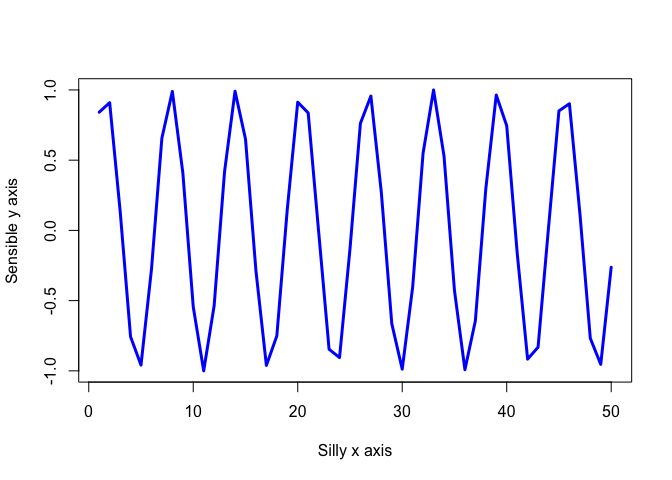

# Intro to R
Yoonjin Lim

``` r
#My first R script
x <- 1:50
plot(x)
```


``` r
plot (x, sin(x))
```


``` r
plot (x, sin(x), typ="l", col="blue", lwd=3, 
      xlab="Silly x axis", ylab="Sensible y axis")
```


