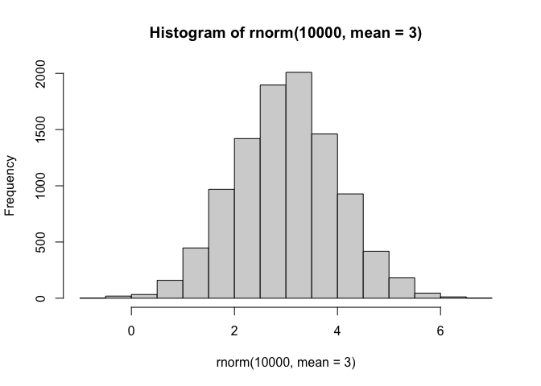
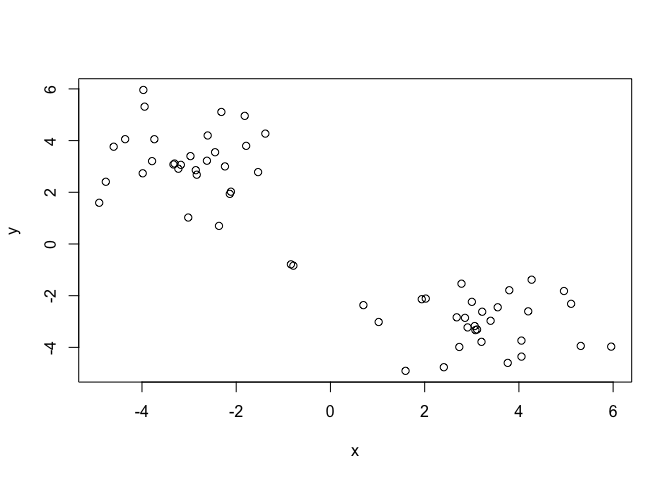
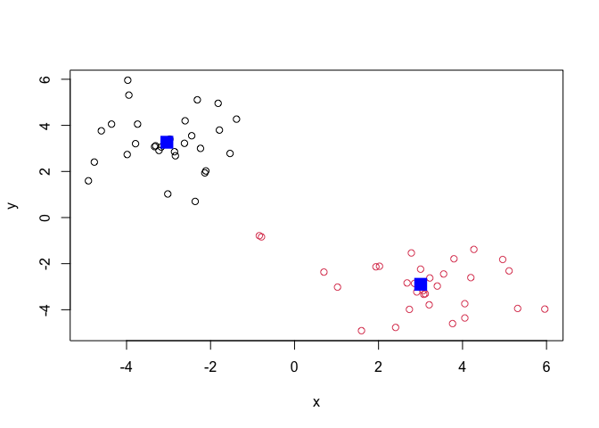
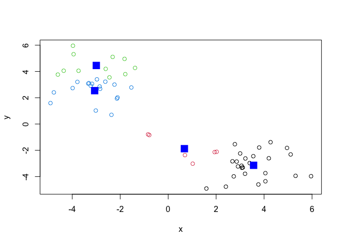
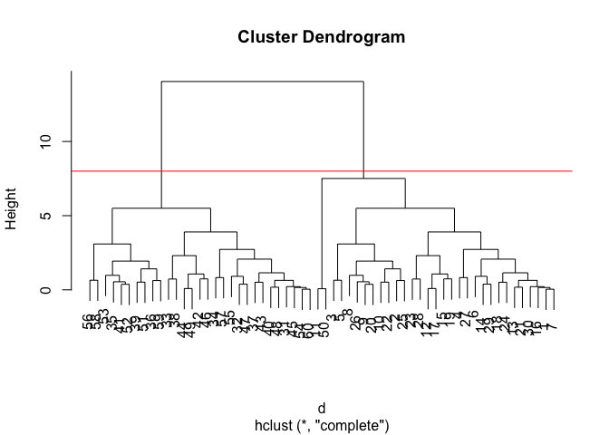
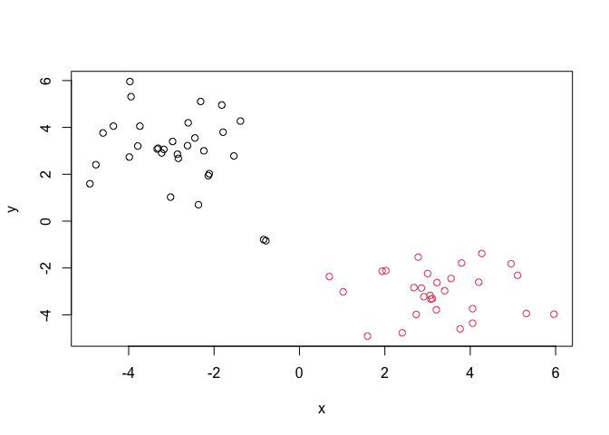
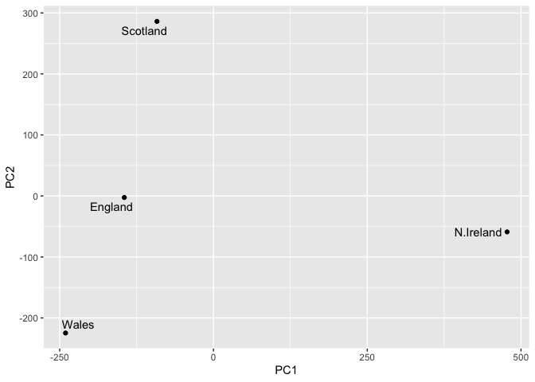

# Class 7: Machine Learning 1
Yoonjin Lim (PID: A16850635)

- [Clustering](#clustering)
  - [K-means](#k-means)
  - [Hierarchical Clustering](#hierarchical-clustering)
- [Principal Component Analysis
  (PCA)](#principal-component-analysis-pca)
  - [Data import](#data-import)
  - [PCA to the rescue](#pca-to-the-rescue)

Today we will explore unsupervised machine learning methods starting
with clustering and dimensionality reduction.

## Clustering

To start let’s make up some data to cluster where we know what the
answer should be. The `rnorm()` function will help us here.

``` r
hist(rnorm(10000, mean=3))
```



Return 30 numbers centered on -3

``` r
tmp <- c ( rnorm(30, mean=-3), 
         rnorm(30, mean=+3) )
x <- cbind(x=tmp, y=rev(tmp))

x
```

                   x          y
     [1,] -3.3321222  3.0771280
     [2,] -1.3818490  4.2703705
     [3,] -3.9444245  5.3129009
     [4,] -4.7675467  2.4069191
     [5,] -3.9711612  5.9590767
     [6,] -3.7375797  4.0538899
     [7,] -3.3077824  3.1118237
     [8,] -2.6056696  4.1977462
     [9,] -2.6212379  3.2208835
    [10,] -2.3148540  5.1080612
    [11,] -0.7869281 -0.8388047
    [12,] -2.1361764  1.9383225
    [13,] -2.8373873  2.6799394
    [14,] -4.3573915  4.0550381
    [15,] -1.5357567  2.7815760
    [16,] -3.1751410  3.0614368
    [17,] -2.1121881  2.0230778
    [18,] -3.9843285  2.7348945
    [19,] -2.2388820  3.0016924
    [20,] -2.4486619  3.5500959
    [21,] -2.8579787  2.8560348
    [22,] -1.8193531  4.9567013
    [23,] -3.0181736  1.0237135
    [24,] -3.7862513  3.2060681
    [25,] -1.7892226  3.7958601
    [26,] -2.9709770  3.3993575
    [27,] -4.9080103  1.5940127
    [28,] -2.3656028  0.6994725
    [29,] -4.6008763  3.7629769
    [30,] -3.2279130  2.9109894
    [31,]  2.9109894 -3.2279130
    [32,]  3.7629769 -4.6008763
    [33,]  0.6994725 -2.3656028
    [34,]  1.5940127 -4.9080103
    [35,]  3.3993575 -2.9709770
    [36,]  3.7958601 -1.7892226
    [37,]  3.2060681 -3.7862513
    [38,]  1.0237135 -3.0181736
    [39,]  4.9567013 -1.8193531
    [40,]  2.8560348 -2.8579787
    [41,]  3.5500959 -2.4486619
    [42,]  3.0016924 -2.2388820
    [43,]  2.7348945 -3.9843285
    [44,]  2.0230778 -2.1121881
    [45,]  3.0614368 -3.1751410
    [46,]  2.7815760 -1.5357567
    [47,]  4.0550381 -4.3573915
    [48,]  2.6799394 -2.8373873
    [49,]  1.9383225 -2.1361764
    [50,] -0.8388047 -0.7869281
    [51,]  5.1080612 -2.3148540
    [52,]  3.2208835 -2.6212379
    [53,]  4.1977462 -2.6056696
    [54,]  3.1118237 -3.3077824
    [55,]  4.0538899 -3.7375797
    [56,]  5.9590767 -3.9711612
    [57,]  2.4069191 -4.7675467
    [58,]  5.3129009 -3.9444245
    [59,]  4.2703705 -1.3818490
    [60,]  3.0771280 -3.3321222

Make a plot of `x`

``` r
plot(x)
```



### K-means

The main function in “base” R for K-means clustering is called
`kmeans()`:

``` r
km <- kmeans(x, centers=2)
km
```

    K-means clustering with 2 clusters of sizes 29, 31

    Cluster means:
              x         y
    1 -3.039810  3.267243
    2  3.004011 -2.896137

    Clustering vector:
     [1] 1 1 1 1 1 1 1 1 1 1 2 1 1 1 1 1 1 1 1 1 1 1 1 1 1 1 1 1 1 1 2 2 2 2 2 2 2 2
    [39] 2 2 2 2 2 2 2 2 2 2 2 2 2 2 2 2 2 2 2 2 2 2

    Within cluster sum of squares by cluster:
    [1]  67.8643 108.2922
     (between_SS / total_SS =  86.4 %)

    Available components:

    [1] "cluster"      "centers"      "totss"        "withinss"     "tot.withinss"
    [6] "betweenss"    "size"         "iter"         "ifault"      

The `kmeans()` function return a “list” with 9 components. You can see
the named components of any list with the `attributes()` function.

``` r
attributes(km)
```

    $names
    [1] "cluster"      "centers"      "totss"        "withinss"     "tot.withinss"
    [6] "betweenss"    "size"         "iter"         "ifault"      

    $class
    [1] "kmeans"

> Q. How many points in each cluster?

``` r
km$size
```

    [1] 29 31

> Q. Cluster assignment/memebership vector?

``` r
km$cluster
```

     [1] 1 1 1 1 1 1 1 1 1 1 2 1 1 1 1 1 1 1 1 1 1 1 1 1 1 1 1 1 1 1 2 2 2 2 2 2 2 2
    [39] 2 2 2 2 2 2 2 2 2 2 2 2 2 2 2 2 2 2 2 2 2 2

> Q. Cluster centers?

``` r
km$centers
```

              x         y
    1 -3.039810  3.267243
    2  3.004011 -2.896137

> Q. Make a plot of our `kmeans()` results showing cluster assignment
> using different colors for each cluster/group of points and cluster
> centers in blue.

``` r
plot(x, col=km$cluster)
points(km$centers, col="blue", pch=15, cex=2)
```



> Q. Run `kmeans()` again on `x` and this cluster into 4 groups/clusters
> and plot the same result figure as above.

``` r
km4 <- kmeans(x, centers=4)
plot(x, col=km4$cluster)
points(km4$centers, col="blue", pch=15, cex=2)
```



> **key-point**: K-means clustering is super popular but can be
> miss-used. One big limitation is that it can impose a clustering
> pattern on your data even if clear natural grouping don’t exist -
> i.e. it does what you tell it to do in terms of `centers`.

### Hierarchical Clustering

The main function in “base” R for hierarchical clustering is called
`hclust()`.

You can’t just pass our dataset as is into `hclust()`. You must give
“distancee matrix” as input. We can get this from the `dist()` function
in R.

``` r
d <- dist(x)
hc <- hclust(d)
hc
```


    Call:
    hclust(d = d)

    Cluster method   : complete 
    Distance         : euclidean 
    Number of objects: 60 

The results of `hclust()` don’t have a useful `print()` method but do
have a special `plot()` method.

``` r
plot(hc)
abline(h=8, col="red")
```



To get our main cluster assignment (membership vector), we need to “cut”
the tree at the big goal posts…

``` r
grps <- cutree(hc, h=8)
grps
```

     [1] 1 1 1 1 1 1 1 1 1 1 1 1 1 1 1 1 1 1 1 1 1 1 1 1 1 1 1 1 1 1 2 2 2 2 2 2 2 2
    [39] 2 2 2 2 2 2 2 2 2 2 2 1 2 2 2 2 2 2 2 2 2 2

``` r
table(grps)
```

    grps
     1  2 
    31 29 

``` r
plot(x, col=grps)
```



Hierarchical Clustering is distinct in that the dendrogram (tree figure)
can reveal the potential grouping in your data (unlike K-means).

## Principal Component Analysis (PCA)

PCA is a common and highly useful dimensionality reduction technique
used in many fields - particularly bioinformatics.

Here we will analyze some data from the UK on food consumption.

### Data import

``` r
url <- "https://tinyurl.com/UK-foods"
x <- read.csv(url)

head(x)
```

                   X England Wales Scotland N.Ireland
    1         Cheese     105   103      103        66
    2  Carcass_meat      245   227      242       267
    3    Other_meat      685   803      750       586
    4           Fish     147   160      122        93
    5 Fats_and_oils      193   235      184       209
    6         Sugars     156   175      147       139

``` r
rownames(x) <- x[,1]
x <- x[,-1]
head(x)
```

                   England Wales Scotland N.Ireland
    Cheese             105   103      103        66
    Carcass_meat       245   227      242       267
    Other_meat         685   803      750       586
    Fish               147   160      122        93
    Fats_and_oils      193   235      184       209
    Sugars             156   175      147       139

``` r
x <- read.csv (url, row.names=1)
head(x)
```

                   England Wales Scotland N.Ireland
    Cheese             105   103      103        66
    Carcass_meat       245   227      242       267
    Other_meat         685   803      750       586
    Fish               147   160      122        93
    Fats_and_oils      193   235      184       209
    Sugars             156   175      147       139

``` r
barplot(as.matrix(x), beside=F, col=rainbow(nrow(x)))
```


One conventional plot that can be useful is called a “paris” plot.

``` r
pairs(x, col=rainbow(nrow(x)), pch=16)
```


### PCA to the rescue

The main function in base R for PCA is called `prcomp()`.

``` r
pca <- prcomp(t(x)) 
summary(pca)
```

    Importance of components:
                                PC1      PC2      PC3       PC4
    Standard deviation     324.1502 212.7478 73.87622 3.176e-14
    Proportion of Variance   0.6744   0.2905  0.03503 0.000e+00
    Cumulative Proportion    0.6744   0.9650  1.00000 1.000e+00

The `prcomp()` function returns a list object of our result with five
attributes/components.

``` r
attributes(pca)
```

    $names
    [1] "sdev"     "rotation" "center"   "scale"    "x"       

    $class
    [1] "prcomp"

The two main “results” in here are `pca$x` and `pca$rotation`. The first
of these (`pca$x`) contains the scores of the data on the new PC axis -
we use these to make our “PCA plot”.

``` r
pca$x
```

                     PC1         PC2        PC3           PC4
    England   -144.99315   -2.532999 105.768945 -4.894696e-14
    Wales     -240.52915 -224.646925 -56.475555  5.700024e-13
    Scotland   -91.86934  286.081786 -44.415495 -7.460785e-13
    N.Ireland  477.39164  -58.901862  -4.877895  2.321303e-13

``` r
library(ggplot2)
library(ggrepel)

# Make a plot of pca$x with PC1 vs. PC2
ggplot(pca$x) + 
  aes (PC1, PC2, label=rownames(pca$x)) +
  geom_point() + 
  geom_text_repel()
```



Notes: Using the ggplot2 packages, this results in a figure describing
lists of vectors and the matrix between four different countries, to
mainly represent the variation: how similar and dissimilar they are from
each other. For example, Scotland, England, and Wales are on same area
(the negative PC1), while N.Ireland are plotted in the other area (the
positive PC1)

So first we will need to take whatever it is we want to plot and convert
it to a data.frame with the as.data.frame() function. Then to make our
plotting life easier we will also add the food labels as a column
(called “Food”) to this data frame with the rownames_to_column()
function from the tibble package (you might need to install this):

The second major result is contained in the `pca$rotation` object or
component. Let’s plot this to see what PCA is picking up…

``` r
ggplot(pca$rotation) +
  aes(PC1, rownames(pca$rotation)) + 
  geom_col()
```


Notes: based on the graph above, this plot specifically describes the
proportion of each component of food in bar representation, based on PC1
value. Therefore, for example, fresh fruit and alcoholic drinks, being
represented significantly high toward the negative PC1, is likely being
consumed in three countries, Scotland, England, and Wales. On the other
hand, soft drinks and fresh potatos, being represented significantly
high toward the positive PC1, is likely consumed in N.Ireland.
