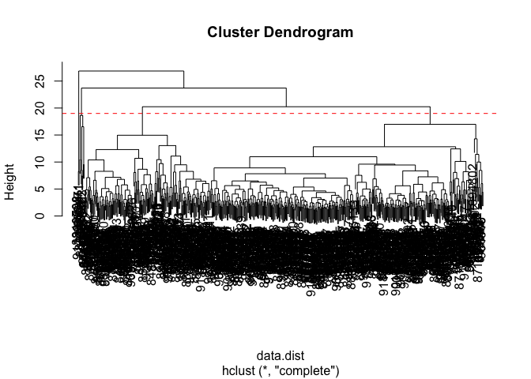

# Class 8: Breast cancer mini project
Yoonjin Lim (PID: A16850635)

- [Background](#background)
- [Data import](#data-import)
- [Clustering](#clustering)
- [Principal Component Analysis](#principal-component-analysis)
  - [The importance data scaling](#the-importance-data-scaling)
  - [PCA of wisc.data](#pca-of-wiscdata)
- [Hierarchical clustering](#hierarchical-clustering)
- [Combining methods](#combining-methods)
  - [Clustering on PCA results](#clustering-on-pca-results)
- [Prediction](#prediction)

## Background

This article provides guidance for a mini-project that performs
unsupervised learning analysis using human breast cancer cell nucleotide
measurement data in the R environment. **Principal Component Analysis
(PCA)** is used as a preprocessing step to reduce the dimensionality of
the data, and hierarchical clustering and K-means clustering are applied
to divide the cells into groups. It also explains the process of
comparing the clustering results with the actual diagnostic results,
predicting new data by projecting them into the PCA space, and
introduces the concepts of sensitivity and specificity in cluster
analysis.

## Data import

Our data come from the U. of Wisconsin Medical Center.

``` r
wisc.df <- read.csv("WisconsinCancer.csv", row.names=1)
```

> Q1. How many patients/samples are in this dataset?

``` r
nrow(wisc.df)
```

    [1] 569

> Q2. How many of the observations have a malignant diagnosis?

``` r
table(wisc.df$diagnosis)
```


      B   M 
    357 212 

``` r
sum (wisc.df$diagnosis == "M")
```

    [1] 212

> Q3. How many variables/features in the data are suffixed with \_mean?

``` r
colnames (wisc.df)
```

     [1] "diagnosis"               "radius_mean"            
     [3] "texture_mean"            "perimeter_mean"         
     [5] "area_mean"               "smoothness_mean"        
     [7] "compactness_mean"        "concavity_mean"         
     [9] "concave.points_mean"     "symmetry_mean"          
    [11] "fractal_dimension_mean"  "radius_se"              
    [13] "texture_se"              "perimeter_se"           
    [15] "area_se"                 "smoothness_se"          
    [17] "compactness_se"          "concavity_se"           
    [19] "concave.points_se"       "symmetry_se"            
    [21] "fractal_dimension_se"    "radius_worst"           
    [23] "texture_worst"           "perimeter_worst"        
    [25] "area_worst"              "smoothness_worst"       
    [27] "compactness_worst"       "concavity_worst"        
    [29] "concave.points_worst"    "symmetry_worst"         
    [31] "fractal_dimension_worst"

``` r
length (grep("_mean", colnames(wisc.df), value=T))
```

    [1] 10

There is a diagnosis column that is the clinician consensus that I want
to exclude from any further analysis. We will come back later and
compare our results to this diagnosis.

``` r
diagnosis <- as.factor (wisc.df$diagnosis)
head(diagnosis) 
```

    [1] M M M M M M
    Levels: B M

Now we can remove it from the `wisc.df`.

``` r
wisc.data <- wisc.df[,-1]
```

## Clustering

Let’s try a `hclust()`.

``` r
hc <- hclust(dist(wisc.data))
plot(hc)
```


We can extract clusters from this rather poor dendrogram/tree with the
`cutree()`.

``` r
grps <- cutree(hc, k=2)
```

How many individuals in each clusters?

``` r
table(grps)
```

    grps
      1   2 
    549  20 

``` r
table (diagnosis)
```

    diagnosis
      B   M 
    357 212 

We can generate a cross-table that compares our cluster `grps` vector
without `diagnosis`vector values.

``` r
table(diagnosis, grps)
```

             grps
    diagnosis   1   2
            B 357   0
            M 192  20

## Principal Component Analysis

### The importance data scaling

The main function for PCA in base R is `prcomp()`. It has a default
input parameter of `scale=FALSE`.

``` r
#prcomp()
head(mtcars)
```

                       mpg cyl disp  hp drat    wt  qsec vs am gear carb
    Mazda RX4         21.0   6  160 110 3.90 2.620 16.46  0  1    4    4
    Mazda RX4 Wag     21.0   6  160 110 3.90 2.875 17.02  0  1    4    4
    Datsun 710        22.8   4  108  93 3.85 2.320 18.61  1  1    4    1
    Hornet 4 Drive    21.4   6  258 110 3.08 3.215 19.44  1  0    3    1
    Hornet Sportabout 18.7   8  360 175 3.15 3.440 17.02  0  0    3    2
    Valiant           18.1   6  225 105 2.76 3.460 20.22  1  0    3    1

We could do a PCA of this data as is and it could be mis-leading…

``` r
pc <- prcomp(mtcars)
biplot(pc)
```


Let’s look at the mean values of each column and their standard
deviation.

``` r
colMeans(mtcars)
```

           mpg        cyl       disp         hp       drat         wt       qsec 
     20.090625   6.187500 230.721875 146.687500   3.596563   3.217250  17.848750 
            vs         am       gear       carb 
      0.437500   0.406250   3.687500   2.812500 

``` r
apply(mtcars, 2, sd)
```

            mpg         cyl        disp          hp        drat          wt 
      6.0269481   1.7859216 123.9386938  68.5628685   0.5346787   0.9784574 
           qsec          vs          am        gear        carb 
      1.7869432   0.5040161   0.4989909   0.7378041   1.6152000 

We can “scale” this data before PCA to get a much better representation
and analysis of all the columns.

``` r
mtscale <- scale(mtcars)
```

``` r
round (colMeans(mtscale))
```

     mpg  cyl disp   hp drat   wt qsec   vs   am gear carb 
       0    0    0    0    0    0    0    0    0    0    0 

``` r
apply(mtscale, 2, sd)
```

     mpg  cyl disp   hp drat   wt qsec   vs   am gear carb 
       1    1    1    1    1    1    1    1    1    1    1 

``` r
pc.scale <- prcomp(mtscale)
```

We can look at the two main results figures from PCA - the “PC plot”
(a.k.a score plot, orientation plot, or PC1 vs. PC2 plot). The “loadings
plot” how the original variables contribute to the new PCs.

A loadings plot of the unscaled PCA results.

``` r
library (ggplot2)

ggplot (pc$rotation) + 
  aes(PC1, rownames(pc$rotation)) + 
  geom_col()
```


Loadings plot of the scaled data.

``` r
ggplot (pc.scale$rotation) + 
  aes(PC1, rownames(pc$rotation)) + 
  geom_col()
```


PC plot of scaled PCA results.

``` r
library (ggrepel)
ggplot(pc.scale$x) + 
  aes(PC1, PC2, label= rownames(pc.scale$x)) + 
  geom_point() + 
  geom_text_repel()
```

    Warning: ggrepel: 6 unlabeled data points (too many overlaps). Consider
    increasing max.overlaps


> **Key point**: In general, we will set \`scale=TRUE when we do PCA.
> This is not the default but probably should be…

We can check the SD and mean of the different columns in `wisc.data` to
see if we need to scale - hint: we do!

### PCA of wisc.data

``` r
wisc.pr <- prcomp(wisc.data, scale=TRUE)
```

To see how well PCA is doing here in terms capturing the variance (or
spread) in the data we can use the `summary()` function.

``` r
summary(wisc.pr)
```

    Importance of components:
                              PC1    PC2     PC3     PC4     PC5     PC6     PC7
    Standard deviation     3.6444 2.3857 1.67867 1.40735 1.28403 1.09880 0.82172
    Proportion of Variance 0.4427 0.1897 0.09393 0.06602 0.05496 0.04025 0.02251
    Cumulative Proportion  0.4427 0.6324 0.72636 0.79239 0.84734 0.88759 0.91010
                               PC8    PC9    PC10   PC11    PC12    PC13    PC14
    Standard deviation     0.69037 0.6457 0.59219 0.5421 0.51104 0.49128 0.39624
    Proportion of Variance 0.01589 0.0139 0.01169 0.0098 0.00871 0.00805 0.00523
    Cumulative Proportion  0.92598 0.9399 0.95157 0.9614 0.97007 0.97812 0.98335
                              PC15    PC16    PC17    PC18    PC19    PC20   PC21
    Standard deviation     0.30681 0.28260 0.24372 0.22939 0.22244 0.17652 0.1731
    Proportion of Variance 0.00314 0.00266 0.00198 0.00175 0.00165 0.00104 0.0010
    Cumulative Proportion  0.98649 0.98915 0.99113 0.99288 0.99453 0.99557 0.9966
                              PC22    PC23   PC24    PC25    PC26    PC27    PC28
    Standard deviation     0.16565 0.15602 0.1344 0.12442 0.09043 0.08307 0.03987
    Proportion of Variance 0.00091 0.00081 0.0006 0.00052 0.00027 0.00023 0.00005
    Cumulative Proportion  0.99749 0.99830 0.9989 0.99942 0.99969 0.99992 0.99997
                              PC29    PC30
    Standard deviation     0.02736 0.01153
    Proportion of Variance 0.00002 0.00000
    Cumulative Proportion  1.00000 1.00000

Let’s make the main PC1 vs PC2.

``` r
ggplot(wisc.pr$x) + 
  aes(PC1, PC2, col=diagnosis) + 
  geom_point() + 
  xlab("PC1 (44.3%)") + 
  ylab("PC2 (19%)")
```


> Q4. From your results, what proportion of the original variance is
> captured by the first principal components (PC1)?

Based on the results above, the proportion of original variance is
captured as around 44.3% of total variance by the first principle
components (PC1).

> Q5. How many principal components (PCs) are required to describe at
> least 70% of the original variance in the data?

Based on the data results above, the proportion of variance represents
the percentage of total variance from the dataset that is captured by
each principal component. On the other hand, the cumulative proportion
indicates the total percentage of variance that is captured by the first
few principal components all combined. To describe at least 70% of the
original variance in the data, I believe that 3 principal components are
required.

> Q6. How many principal components (PCs) are required to describe at
> least 90% of the original variance in the data?

To describe at least 90% of the original variance in the data, 7
principal components are needed based on all the explanations on what
the proportion of variance and the cumulative proportion above in Q5.

> Q7. What stands out to you about this plot? Is it easy or difficult to
> understand? Why?

``` r
biplot(wisc.pr)
```


After getting the result of this plot using `biplot()`, I first noticed
that it is very difficult for me to interpret the plot. Because all the
data were stack on each other and especially several different labels of
the plot are completely overlapped on each other, I felt poorly
difficult to even read and interpret the data.

Therefore, I rather utilized `plot()` to generate more standard scatter
plot of each observation to compare between PC1 and PC2.

``` r
plot(wisc.pr$x, col = diagnosis , 
     xlab = "PC1", ylab = "PC2")
```


> Q8. Generate a similar plot for principal components 1 and 3. What do
> you notice about these plots?

``` r
plot(wisc.pr$x[, c(1,3)], col= diagnosis, 
     xlab = "PC1", ylab = "PC3")
```


Based on the plot above, I first noticed that this plot is quite similar
to the plot comparing between PC1 and PC2. However, the main difference
is that more black dots (benign) are quite mixed with red dots
(malignant) in this plot, unlike the plot comparing along PC1 and PC2.
The plot comparing along PC1 and PC2 describes more clear dot separation
between two groups of malignant and benign samples. More in detail, dot
separation usually represents the degree to which the points can be
differentiated based on the values along their principal components.
Therefore, more clear separation between dots infers that the points are
more different from each other, indicating greater variance captured by
these components. The above plot along PC3 and PC1 illustrating
overlapping dots therefore suggests less differentiation, explaining
less of overall data variance when compared by PC2 and PC1.

> Q9. For the first principal component, what is the component of the
> loading vector (i.e. wisc.pr\$rotation\[,1\]) for the feature
> concave.points_mean?

``` r
wisc.pr$rotation["concave.points_mean", 1]
```

    [1] -0.2608538

Based on the result, the value -0.2608538 describes the extent to which
the feature “concave.points_mean” contributes to PC1.

> Q10. What is the minimum number of principal components required to
> explain 80% of the variance of the data?

``` r
pr.var <- wisc.pr$sdev^2
head (pr.var)
```

    [1] 13.281608  5.691355  2.817949  1.980640  1.648731  1.207357

``` r
pve <- pr.var/sum(pr.var)
plot(pve, xlab = "Principal Component", 
     ylab = "Proportion of Variance Explained", 
     ylim = c(0, 1), type = "o")
```


``` r
barplot(pve, ylab = "Precent of Variance Explained",
     names.arg=paste0("PC",1:length(pve)), las=2, axes = FALSE)
axis(2, at=pve, labels=round(pve,2)*100 )
```


``` r
library(factoextra)
```

    Welcome! Want to learn more? See two factoextra-related books at https://goo.gl/ve3WBa

``` r
fviz_eig(wisc.pr, addlabels = TRUE)
```


Based on all the results above, I believe that minimum 5 principal
components are required to explain 80% of the variance of the data.

## Hierarchical clustering

``` r
data.scaled <- scale (wisc.data)
```

``` r
data.dist <- dist (data.scaled)
```

``` r
wisc.hclust <- hclust (data.dist, method="complete")
```

``` r
plot(wisc.hclust)
abline(h=19, col="red", lty=2)
```



> Q11. Using the `plot()` and `abline()` functions, what is the height
> at which the clustering model has 4 clusters?

Based on the plot above, I believe that the height at which the
clustering model has 4 clusters is 19.

## Combining methods

We can take our PCA results and use them as a basis set for other
analysis such as clustering.

### Clustering on PCA results

``` r
wisc.pr.hclust <- hclust (dist(wisc.pr$x[,1:2]), method="ward.D2")
plot(wisc.pr.hclust)
```


``` r
wisc.pr.hclust <- hclust (dist(wisc.pr$x[,1:2]), method="single")
plot(wisc.pr.hclust)
```


``` r
wisc.pr.hclust <- hclust (dist(wisc.pr$x[,1:2]), method="complete")
plot(wisc.pr.hclust)
```


``` r
wisc.pr.hclust <- hclust (dist(wisc.pr$x[,1:2]), method="average")
plot(wisc.pr.hclust)
```


We can “cut” this tree to yield our clusters (groups):

``` r
pc.grps <- cutree(wisc.pr.hclust, k=2)
table(pc.grps)
```

    pc.grps
      1   2 
     22 547 

How do my cluster grps compare to the expert diagnosis

``` r
table(diagnosis, pc.grps)
```

             pc.grps
    diagnosis   1   2
            B   0 357
            M  22 190

``` r
table(diagnosis)
```

    diagnosis
      B   M 
    357 212 

> Q13. Which method gives your favorite results for the same data.dist
> dataset? Explain your reasoning.

Based on the results above for each dendrogram, I believe that the
method ward.D2 gives my favorite results for the same data.dist dataset.
There are several different methods to determine which clusters should
be linked during hierarchical clustering procedure, such as “complete”,
“single”, and “average”, including “ward.D2”. Using bottom-up approach,
hierarchical clustering generally start from the bottom with each data
point and then go up to merge these each cluster together in sequential
process based on their closeness or their smallest dissimilarity. Based
on each dendrogram created for each method, I noticed that using method
“ward.D2” created the best result because the “ward.D2” specifically
aims to minimize the increase in total within-cluster variance when
linking clusters. Therefore, this dendrogram is well-shaped and compact,
leading to more interpretable and clear results, when compared to the
other dendrograms. For example, the method “single” is fast enough, but
calculating all similarities between all points in one cluster and all
points in second cluster by using smallest of similarities may produce
too elongated and numerous mini chain-formed clusters. This may create a
problem with noisy data and be a less effective method.

> Q15. How well does the newly created model with four clusters separate
> out the two diagnoses?

Basically, hierarchical clustering illustrates the relationship between
given dataset by creating a hierarchical tree, dendrogram. This
dendrogram then indicates how certain dataset are clustered at different
levels, based on the similarity, using distance matrix for our case.
This distance matrix between the clusters indicates how similar or
different the clustered groups are. Specifically, we utilized
hierarchical clustering based on first two principal components of PCA
results. Using function `cutree()`, we specifically divided hierarchical
clustering tree into 2 groups.

After we created the table combining two variables, diagnosis and pr.
grps, based on the results above, I believe that the newly created model
with four clusters pretty well separates out of two diagnosis. Based on
the table created, the most benign samples (339 samples) are in cluster
2 and most malignant samples are in cluster 1 (177 samples), suggesting
that clustering works effectively well to separate two categories of
data based on principal components. Jut only 18 samples in cluster 1 is
benign and 35 samples in cluster 2 are malignant.

> Q16. How well do the k-means and hierarchical clustering models you
> created in previous sections (i.e. before PCA) do in terms of
> separating the diagnoses? Again, use the table() function to compare
> the output of each model (wisc.km\$cluster and wisc.hclust.clusters)
> with the vector containing the actual diagnoses.

They did really badly. We do much better after PCA - the new PCA
variables (what we call a basis set) give us much beetter separation of
M and B.

## Prediction

We can use our PCA model for the analysis of new “unseen” data. In this
case from U. Mich.

``` r
url <- "https://tinyurl.com/new-samples-CSV"
new <- read.csv(url)
npc <- predict(wisc.pr, newdata=new)
npc
```

               PC1       PC2        PC3        PC4       PC5        PC6        PC7
    [1,]  2.576616 -3.135913  1.3990492 -0.7631950  2.781648 -0.8150185 -0.3959098
    [2,] -4.754928 -3.009033 -0.1660946 -0.6052952 -1.140698 -1.2189945  0.8193031
                PC8       PC9       PC10      PC11      PC12      PC13     PC14
    [1,] -0.2307350 0.1029569 -0.9272861 0.3411457  0.375921 0.1610764 1.187882
    [2,] -0.3307423 0.5281896 -0.4855301 0.7173233 -1.185917 0.5893856 0.303029
              PC15       PC16        PC17        PC18        PC19       PC20
    [1,] 0.3216974 -0.1743616 -0.07875393 -0.11207028 -0.08802955 -0.2495216
    [2,] 0.1299153  0.1448061 -0.40509706  0.06565549  0.25591230 -0.4289500
               PC21       PC22       PC23       PC24        PC25         PC26
    [1,]  0.1228233 0.09358453 0.08347651  0.1223396  0.02124121  0.078884581
    [2,] -0.1224776 0.01732146 0.06316631 -0.2338618 -0.20755948 -0.009833238
                 PC27        PC28         PC29         PC30
    [1,]  0.220199544 -0.02946023 -0.015620933  0.005269029
    [2,] -0.001134152  0.09638361  0.002795349 -0.019015820

``` r
plot(wisc.pr$x[,1:2], col=diagnosis)
points(npc[,1], npc[,2], col="blue", pch=16, cex=3)
text(npc[,1], npc[,2], c(1,2), col="white")
```


> Q18. Which of these new patients should we prioritize for follow up
> based on your results?

First, the color of samples in the plot indicates each diagnosis: benign
in black and malignant in red. Each principal component indicates a
combination of the original features from the dataset which maximizes
variance in the data. The numeric data above represents the scores of
the new data samples on each of the principal components, describing
where each new sample basically lies in PCA space, relative to the
principal component. Based on the plot created for projected new data
sample above along PC1 and PC2 (PCA space), it is likely for the benign
sample in black to occupy the region with higher PC1 values and low PC2.
On the other hand, the malignant sample in red occupies the regions with
lower PC1 values and low PC2. Now, combining with the given dataset for
the new samples, I could conclude that patient 2 are likely to be
malignant because the new data point for patient 2 was landed on
somewhere with lower PC1 values and low PC2. Patient 1’s sample was, on
the other hand, landed on somewhere with higher PC1 value and low PC2,
indicating as being benign. Therefore, patient 2 is likely to arise the
malignant cases, which we should prioritize for follow up.
